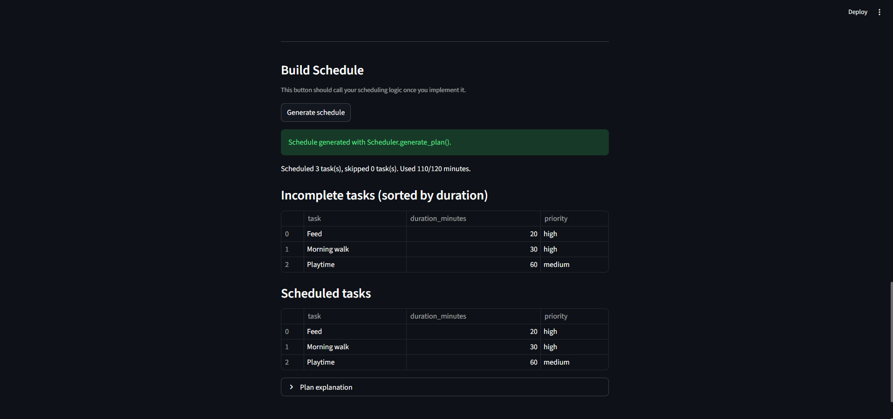

# PawPal+ (Module 2 Project)

You are building **PawPal+**, a Streamlit app that helps a pet owner plan care tasks for their pet.

## Scenario

A busy pet owner needs help staying consistent with pet care. They want an assistant that can:

- Track pet care tasks (walks, feeding, meds, enrichment, grooming, etc.)
- Consider constraints (time available, priority, owner preferences)
- Produce a daily plan and explain why it chose that plan

Your job is to design the system first (UML), then implement the logic in Python, then connect it to the Streamlit UI.

## What you will build

Your final app should:

- Let a user enter basic owner + pet info
- Let a user add/edit tasks (duration + priority at minimum)
- Generate a daily schedule/plan based on constraints and priorities
- Display the plan clearly (and ideally explain the reasoning)
- Include tests for the most important scheduling behaviors

## Getting started

### Setup

```bash
python -m venv .venv
source .venv/bin/activate  # Windows: .venv\Scripts\activate
pip install -r requirements.txt
```

### Suggested workflow

1. Read the scenario carefully and identify requirements and edge cases.
2. Draft a UML diagram (classes, attributes, methods, relationships).
3. Convert UML into Python class stubs (no logic yet).
4. Implement scheduling logic in small increments.
5. Add tests to verify key behaviors.
6. Connect your logic to the Streamlit UI in `app.py`.
7. Refine UML so it matches what you actually built.

## Smarter Scheduling

This version of PawPal+ includes a few extra scheduling tools:

- Sort tasks by duration-derived HH:MM time values.
- Filter tasks by completion status or pet name.
- Automatically create the next recurring task for daily or weekly items when one is completed.
- Detect schedule conflicts and return warning messages instead of crashing.

## Features

- Priority-aware daily planning:
	Uses a greedy scheduling approach that orders tasks by priority (`high` -> `medium` -> `low`) and then by shorter duration, scheduling only tasks that fit the owner's available minutes.
- Sorting by time:
	Sorts tasks by duration-derived HH:MM with deterministic tie-breaking by task name, and supports ascending or descending order.
- Filtering tasks:
	Filters tasks by completion state and/or pet name (case-insensitive, whitespace-tolerant matching).
- Conflict warnings:
	Validates strict HH:MM input and returns warnings (instead of raising exceptions) when times are invalid or overlapping.
- Conflict type classification:
	Distinguishes same-pet conflicts from multi-pet conflicts for clearer schedule feedback.
- Daily and weekly recurrence:
	Automatically creates the next task instance when a recurring task is completed.
- One-off task behavior:
	Supports `as_needed` tasks that complete without creating a next occurrence.
- Explainable output:
	Produces a summary and per-task reasons for scheduled and skipped tasks.

## 📸 Demo

Final Streamlit app screenshot:



Caption: This demo view shows the owner/pet inputs, task entry form, sorted task table, conflict-warning checks, and generated schedule output with explanations.

## Testing PawPal+

Run tests with:

python -m pytest

The tests currently cover core scheduling reliability, including task completion state changes, task addition, sorting by duration (ascending/descending and tie behavior), filtering by completion and pet name, recurring task next-date logic and follow-up creation, conflict detection (same-pet and multi-pet), and important edge cases such as empty task/pet states, not-found completion paths, non-recurring completion behavior, calendar-boundary recurring dates, duplicate recurring name collisions, and plan-generation boundaries.

Confidence Level: 5/5 stars

Rationale: latest local run reports 25 passed, 0 failed.
